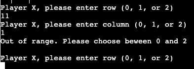

# [Tic-Tac-Toe](https://tic-tac-toe-svgint-bf602e1b6c57.herokuapp.com/)

Tic-Tac-Toe is a Python termonal game , which run in mock terminal in Heroku.
Two players are requred to play the game, The winner is the first player to put three of thier symbols in the row, column or dioganal. If non of the player achieve it its a draw.

[Click here or on the title of README.md to access live version of my project](https://tic-tac-toe-svgint-bf602e1b6c57.herokuapp.com/)

## How to play

1. Game is played on a 3x3 board
2. Players choose the X or O for their symbol.
3. Players take turns to choose the cell on the game board.
4. Place three of the symbols in a row, column or dioganal and win
5. If the entire board is filled and there is no winner, the game is a draw.  
    Good Luck! :)

## Features

### Existing Features
 - Displays the set of rules of the game
 - Lets 1st player to choose X or O and assignes the other symbol to 2nd player
 
 - Prints the tic tac toe game grid
 - Lets player to choose the row and column on the grid and places the chosen symbol on the game grid
 
 - Switched the players after every move
 
 - Will check row, colums and diogonals for the winner and display the winner as soon as the criteria to become one is achieved

 
 
 
 - If the board is full and there is no winner will disply a message "Its a tie"  
 
 - Input validation
   - Error message will appear if player will try to choose something other then X or O for their symbol
   
   - Error message appears if not a number entered when choosing row and column
   
   - Out of range massage appears if player enetered number greater then 2 when coosing row or column.
   
   - Will flag if the chosen space is olready occupied
   

## Future Features

Create a game play agains a computer and to be able to switch between computer and 2 player modes

## Bugs

Solved bugs:

 - Had few issues with indentations and was not able to run the code.

 - Had a mistake in def move function which made my code run in the loop without moving to the nextstep in the game, took me a while to spot it.
 
## Validator Testing
Checked in PEP8
 - No Errors

## Deployment
To deploy this project I followed step by step instruction from Code Institute Deployment Video
 - In Heroku opened dashboard
 - Created new app 
 - Conected my GitHub and choose needed repo
 - In settings done Reveal Config Vars PORT 8000
 - Add buildpacks: 1.python and 2.nodejs
 - Chouse manual deploymnet and Deploed Brunch
 - Viev App

## Credits
 - https://github.com/SvGin/tic_tac_toe/blob/main/run.py This is my repo in GitHub. When I started my 3rd project I used wronng template and when done Deploymnet realised my mistake. So created new repo using correct template and most of the code comes from my first attempt :)
  - For inspiration and some guidance I used this resources:
    - [GitHub](https://gist.github.com/qianguigui1104/edb3b11b33c78e5894aad7908c773353)
    - [tic-tac-toe-game-in-python](https://www.c-sharpcorner.com/UploadFile/75a48f/tic-tac-toe-game-in-python/)
    - [CodeInstitute ReadME](https://learn.codeinstitute.net/courses/course-v1:CodeInstitute+PE_PAGPPF+2021_Q2/courseware/b3378fc1159e43e3b70916fdefdfae51/605f34e006594dc4ae19f5e60ec75e2e/)
    - Love Sandwiches - Essentials Project from Code Institute
     - [How to code tic tac toe in python](https://www.youtube.com/watch?v=n2o8ckO-lfk)
     - [Python TIC TAC TOE Tutorial](https://www.youtube.com/watch?v=dK6gJw4-NCo&list=PLr66KBzyOhBXULXhbdP_Z5dGmSiI27fVc)
